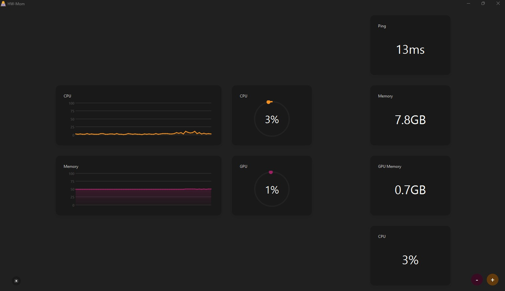
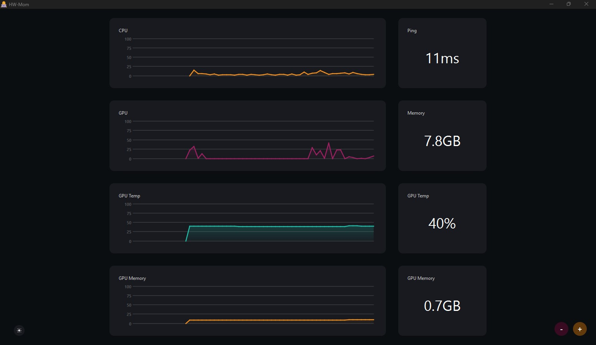
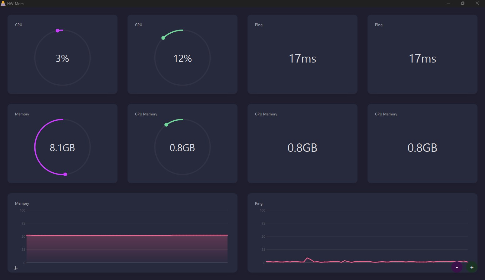

# HWMom

An ultra-lightweight hardware monitoring application that displays system metrics through an elegant dashboard with live-updating widgets. Designed for simplicity, elegance, and customization.

**Screenshots:**

|  |  |
|---|---|
|    |  |


### Features
- Real-time monitoring of system metrics (CPU usage, RAM, temperatures, etc.)
- Modern, minimalist interface
- Customizable layouts, widgets, colors, and themes.
- Extremely low resource footprint

## Installation
Currently only supports building from source (run `build.py`). Executable coming soon...

## Widgets
- Number widget
    * Display a number with a label
    * Example numbers: Temperatures, CPU Usage, RAM Usage, Disk Usage, etc.
    * Option to display instantaneus values or average values over a period of time
- Bar chart widget
    * Display a bar chart showing a number relative to a maximum value (e.g. a percentage)
    * Supports multiple bars in a single widget
    * Supports both horizontal and vertical bars
    * Example bar charts: CPU Usage, RAM Usage, Disk Usage, etc.
- Circle widget
    * Displays a number in the middle, encircled by a thin bar chart
    * Example circle widgets: CPU Usage, RAM Usage, Disk Usage, etc.
- Graph widget
    * Display a graph showing the evolution of a number over time
    * Supports multiple graphs in a single widget.
    * Options for both 60-seconds and 360-seconds historical data window
    * Example graphs: CPU Usage, RAM Usage, Disk Usage, etc.

## Themes
*Coming soon*


## Limitations
- GPU metrics currently only supports NVIDIA GPUs.
- CPU temperature and fan speed currently not supported on Windows.


## Project structure
```
hw-mom/
├── src/
│   ├── __init__.py
│   ├── main.py
│   ├── app.py
│   ├── widgets/
│   │   ├── __init__.py
│   │   ├── base_widget.py
│   │   ├── number_widget.py
│   │   ├── bar_widget.py
│   │   ├── circle_widget.py
│   │   └── graph_widget.py
│   ├── collectors/
│   │   ├── __init__.py
│   │   └── system_metrics.py
│   └── utils/
│       ├── __init__.py
│       └── themes.py
├── requirements.txt
└── README.md
```
