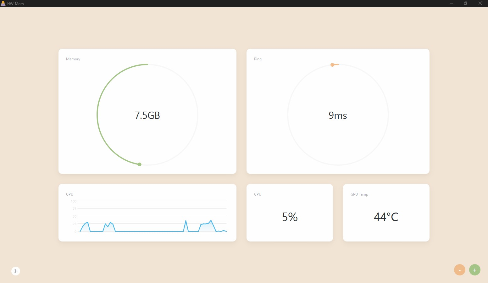

# HWMom

An ultra-lightweight hardware monitoring application that displays system metrics through an elegant dashboard with live-updating widgets. Designed for simplicity, elegance, and customization.

**Screenshots:**

|  |  |
|---|---|
|    |  |


## Features
- Real-time monitoring of system metrics (CPU usage, RAM, temperatures, etc.)
- Modern, minimalist interface
- Customizable layouts, widgets, colors, and themes.
- Extremely low resource footprint

## Installation
Currently only supports building from source (run `build.py`). Executable coming soon...

## Limitations
- GPU metrics currently only supports NVIDIA GPUs.
- CPU temperature and fan speed currently not supported on Windows.

# How to create a layout

When the app is lauched, it loads the layout defined in the `settings/default_layout.txt` text file.

In it, widgets are created with the following syntax: 
`[{widget_type} {metric} {height}x{width} {color_scheme}]` 
(without brackets), where:

- `widget_type`: The type of widget to create.
    - Must be one of `graph`, `circle`, `text`, `separator`.
- `metric`: The metric to display.
    - Must be one of `cpu`, `gpu`, `gpu_temp`, `gpu_memory`, `ping`.
- `height` and `width`: The height and width of the widget. 
    -  Must be integers.
- `color_scheme`: The color scheme of the widget.
    - Must be one of `color a`, `color b`, `color c`.

Layouts are created by placing widgets next to each other, separated by `[]` brackets. Use new lines to indicate the end of a row and empty brackets (`[ ]`) to reserve space in case a widget spans more than one row. See examples below.

The default color theme can be specified by adding either `theme: dark` or `theme: light` to the beginning of the text file.

> *Tip*: because of dynamic resizing, only relative sizes matter. There is no difference between a lone 1x1 widget and a lone 2x2 widget.

> *Tip*: `'[... 1x1][... 1x1]'` is equivalent to `'[... 1x2]'`.


**Example 1:**
```
theme: dark
[separator 1x8][text ping 1x2]
[separator 1x1][graph cpu 1x4][circle cpu 1x2][separator 1x1][text memory 1x2][separator 1x1]
[separator 1x1][graph gpu_temp 1x4 color b][circle gpu 1x2 color b][separator 1x1][text gpu_memory 1x2][separator 1x1]
[separator 1x8][text cpu 1x2]
```
This will create a layout with 5 rows (since there are 5 rows in the text file) and 10 columns (since the maximum sum of widths over all rows is 6).

**Example 2:**
```
[separator 4x1][graph cpu 1x3][text ping 1x1][separator 4x1]
[][graph gpu 1x3 color b][text memory 1x1][]
[][graph gpu_temp 1x3 color c][text gpu_temp 1x1][]
[][graph gpu_memory 1x3 color a][text gpu_memory 1x1]
```

**Example 3:**
```
theme: light
[separator 1x5][separator 1x5]
[separator 1x1][circle memory 4x4][circle ping 4x4 color b]
[separator 1x1][][]
[separator 1x1][][]
[separator 1x1][][]
[separator 1x1][graph gpu 2x4 color c][text cpu 2x2][text gpu_temp 2x2]
[separator 1x1][][][][]
[separator 1x5][separator 1x5]
```

**Example 4:**
```
theme: dark
[circle cpu 1x1 color b][circle gpu 1x1 color a][text ping 1x1][text ping 1x1]
[circle memory 1x1 color b][circle gpu_memory 1x1 color a][text gpu_memory 1x1][text gpu_memory 1x1]
[graph memory 1x2 color c][graph ping 1x2 color c]
```


# Themes
The available themes can be modified by editing the `settings/themes.json` file. See `settings/sample_themes.json` for examples.

> *Tip*: you can also edit the icon by modifying `assets/icon.png`.
